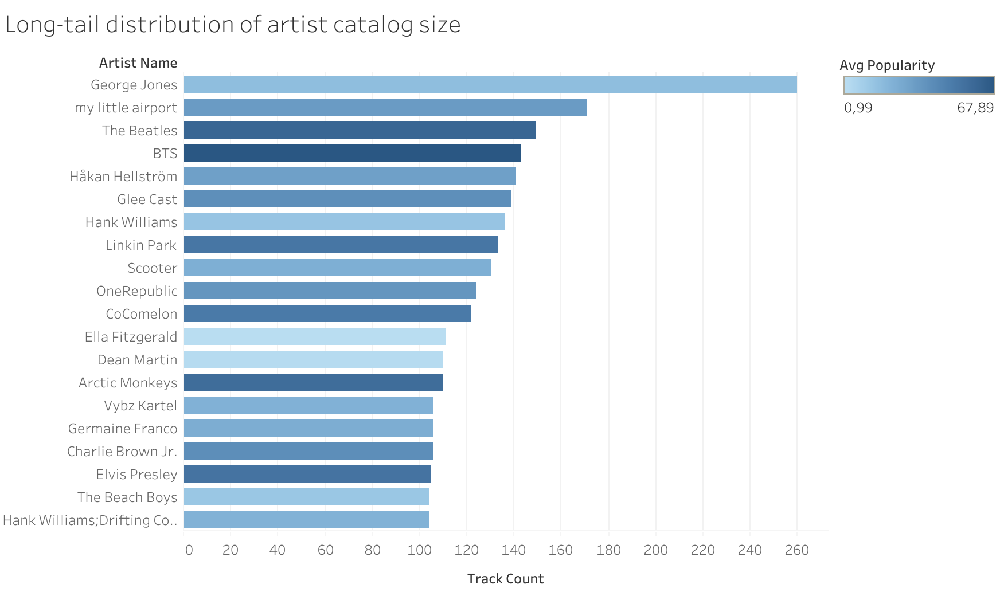

# Spotify Content Analytics: Hit Probability & Catalog Dynamics (SQL + Tableau)

This project analyzes structural patterns in a large-scale Spotify track dataset using **PostgreSQL** (metric computation) and **Tableau** (communication layer).  
It goes beyond descriptive averages by estimating **hit probability lift** across feature ranges to surface signals associated with breakout tracks.

---

## Dataset

- **Source:** Public Spotify Tracks dataset (commonly shared via Kaggle/Hugging Face mirrors)
- **Scale:** ~90k tracks
- **Fields used:** popularity (0–100), audio features (danceability, energy, etc.), genre, artist/track metadata

---

## Repo structure (recommended)

Use a structure that is easy for a reviewer to skim in under 60 seconds:

```
.
├── python/
│   └── 01_prepare_tracks_csv.ipynb        # download/clean/export spotify_tracks_clean.csv
│
├── sql/
│   ├── 00_schema.sql                      # create tables
│   ├── 01_load_notes.sql                  # (optional) notes about import steps in DBeaver
│   └── queries/
│       ├── 01_long_tail_top10.sql
│       ├── 02_popularity_by_danceability_deciles.sql
│       ├── 03_genre_popularity_top30.sql
│       └── 04_hit_lift_by_danceability_decile.sql
│
├── exports/                                # optional (small CSV outputs for Tableau)
│   ├── long_tail_top10.csv
│   ├── popularity_by_danceability_deciles.csv
│   ├── genre_popularity_top30.csv
│   └── hit_lift_danceability_decile.csv
│
├── tableau_graphics/
│   ├── long_tail_top10.png
│   ├── avg_popularity_danceability_deciles.png
│   ├── avg_popularity_genre_top30.png
│   └── hit_lift_danceability_decile.png
│
└── README.md
```

### Notes
- Keep **SQL as the source of truth** for metrics (Tableau reads exported metric tables).
- Rename Tableau exports to meaningful filenames (avoid `Sheet 10.png` etc.).
- If your CSV exports are large, don’t commit them—commit only small “final metric tables” used by Tableau.

---

## How to reproduce

1. Run the notebook in `python/` to create `spotify_tracks_clean.csv` (or equivalent).
2. Create the table by running `sql/00_schema.sql` in PostgreSQL.
3. Import the CSV into `spotify_tracks` via **DBeaver → Import Data**.
4. Run the queries in `sql/queries/` and export their result sets to `exports/` (CSV).
5. Build Tableau visuals from those exported metric tables and save images to `tableau_graphics/`.

---

## Results (Tableau)

### 1) Long-tail distribution of artist catalog size (Top 10)


**Key insight:** Catalog representation is highly concentrated (long-tail). Large catalog size does not automatically imply high average popularity.

---

### 2) Average track popularity across danceability deciles


**Key insight:** Average popularity tends to increase across mid-to-high danceability ranges, but averages alone don’t capture breakout likelihood.

---

### 3) Average popularity by genre (Top 30, min. 100 tracks)


**Key insight:** Popularity differs across genres, suggesting systematic differences in audience size and/or platform exposure.

---

### 4) Hit probability lift by danceability decile (core analysis)


**Definition:** `Hit = popularity >= 70`  
**Overall hit rate:** **3.48%** (3,126 / 89,741)

**Key insight:** Hit probability increases monotonically with danceability.  
Tracks in the highest danceability decile have **~1.60× lift** vs average hit rate, while low danceability bins under-index strongly.

---

## What this project demonstrates

- SQL-first metric design (aggregation, binning, probability, lift)
- Translating feature patterns into **decision-oriented** metrics (hit probability vs mean popularity)
- Communicating results with clean Tableau visuals and proper baselines (lift reference line)

---

## Author

Phillip Olshausen
